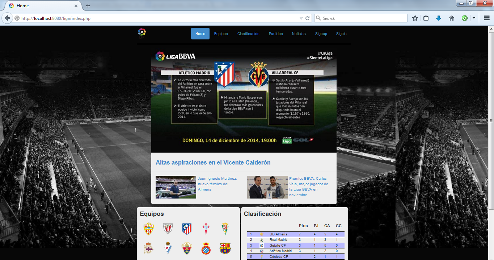
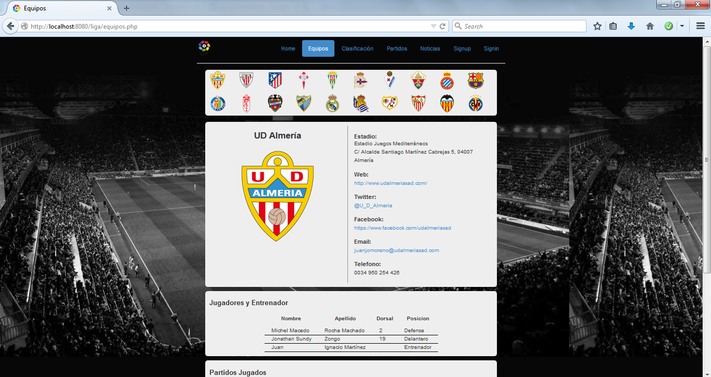
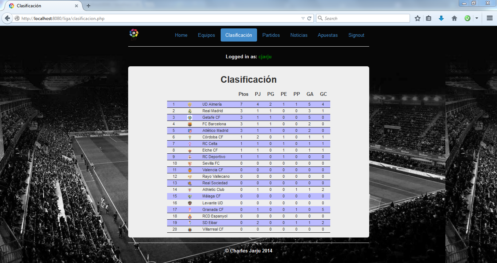
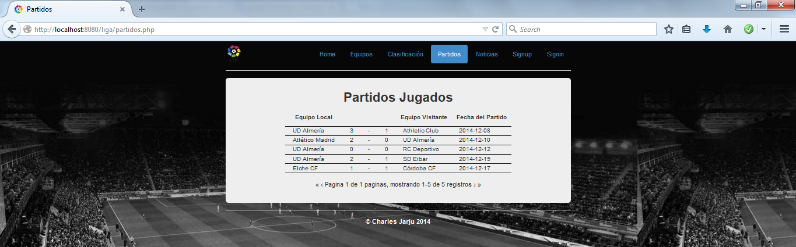
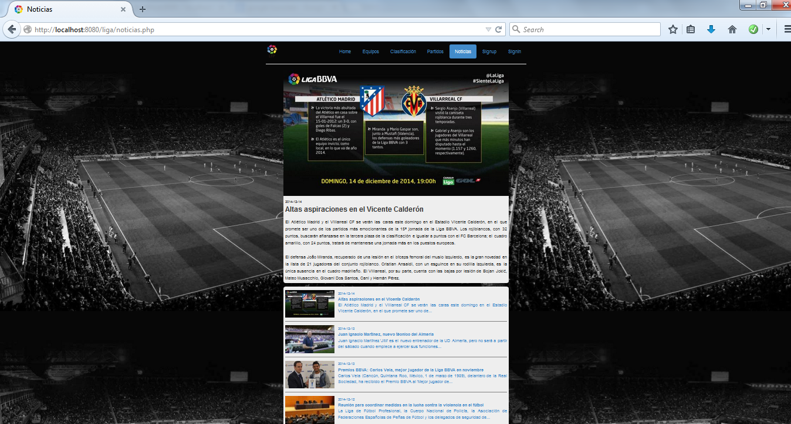
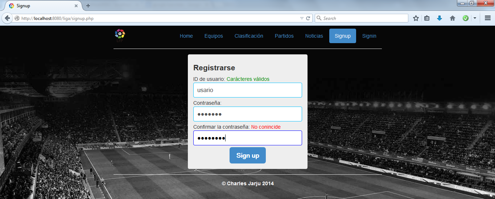
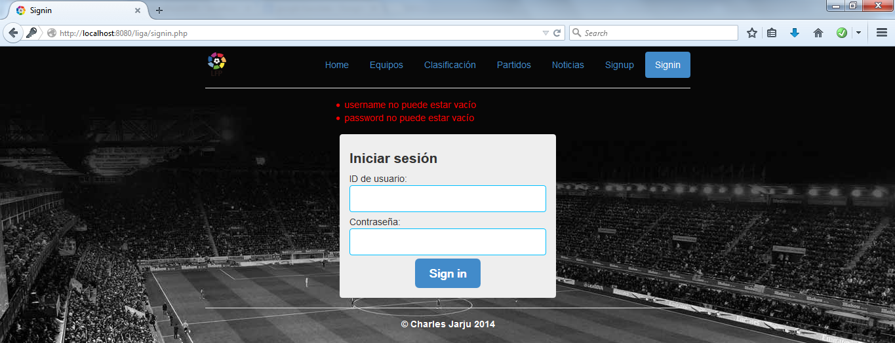
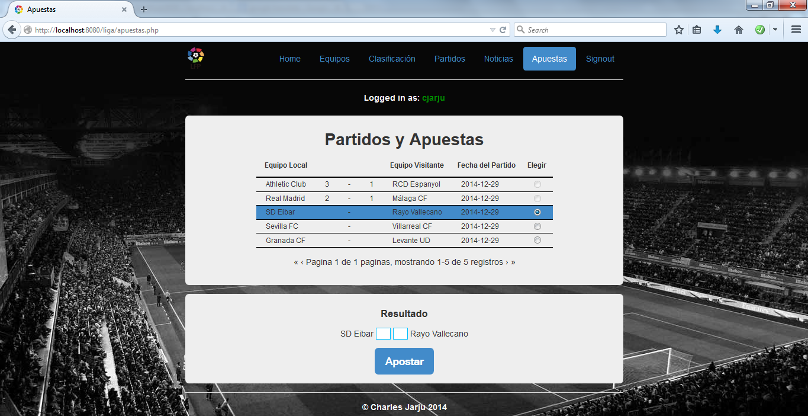
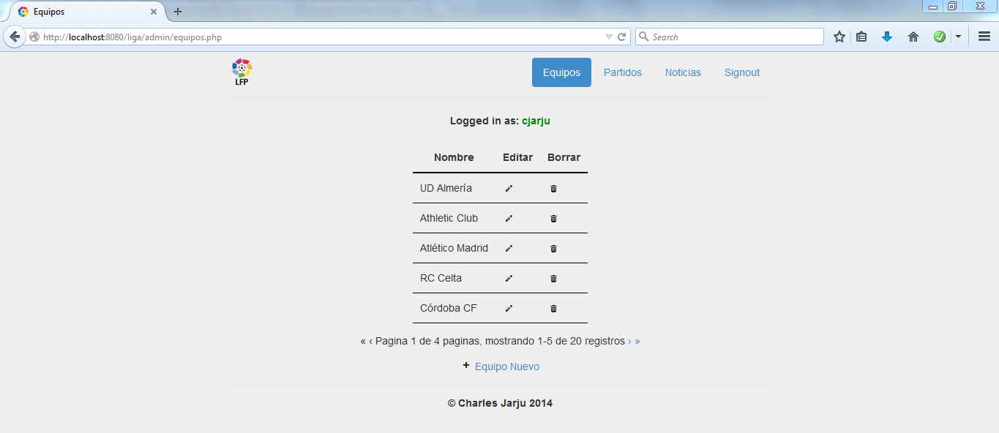
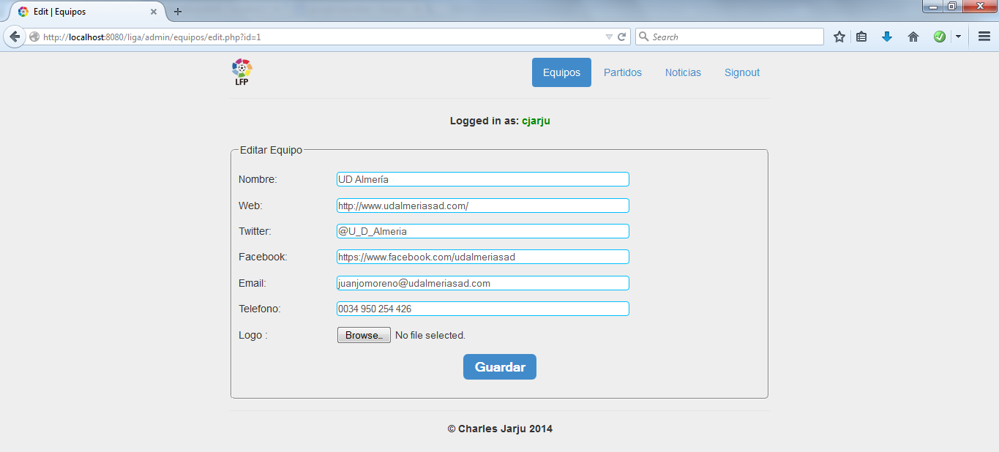

# LaLiga Website Mock

A mock recreation of the official LaLiga website built as part of a web development course.

## Demo

### Home page
<p align="center">
  
</p>

### Teams page
<p align="center">
  
</p>

### Standings page
<p align="center">
  
</p>

### Results page
<p align="center">
  
</p>

### News page
<p align="center">
  
</p>

### Signup page
<p align="center">
  
</p>

### Signup page
<p align="center">
  
</p>

### Betting page
<p align="center">
  
</p>

### Admin pages
<p align="center">
  
</p>

<p align="center">
  
</p>

## About Project
Mock version of the LaLiga (Spanish football league) website built with vanilla PHP (without a PHP framework) as part of an online university web programming course.

The multi-page website features team information, league standings, match schedules, news, and betting functionality. The site is served via Apache (PHP 8.1 with GD extension) and uses MySQL for data storage.

## Tech Stack
- HTML
- Vanilla CSS
- Vanilla JavaScript
- AJAX
- Vanilla PHP

## System Dependencies
- Docker + Docker Compose (recommended)
- PHP 8.1 with Apache (containerized, includes GD extension for image handling)
- MySQL 8.0 (containerized)

Optional local-only development requires PHP and MySQL installed locally; Docker is recommended.

## Getting Started
This section contains the steps necessary to get the application up and running.

### Prerequisites
1. Clone the repository:

   ```bash
   git clone <repository-url>
   cd laliga
   ```

2. Copy environment file:

   ```bash
   cp .env.example .env
   ```

3. Edit `.env` as needed (defaults work out of the box):
   - `APP_URL=http://localhost:8080` (external access)
   - MySQL credentials: `MYSQL_DATABASE=laliga_db`, `MYSQL_USER=webapp`, `MYSQL_PASSWORD=webapp_pass`

### Containerized Setup
1. Build images:

   ```bash
   docker compose build
   ```

2. Start services (Apache/PHP, MySQL):

   ```bash
   docker compose up -d
   ```

3. Create the database:

   ```bash
   docker compose exec mysql \
     sh -c 'MYSQL_PWD="${MYSQL_ROOT_PASSWORD}" \
       mysql -u root -e "CREATE DATABASE IF NOT EXISTS ${MYSQL_DATABASE}"'
   ```

4. Import the sample dataset:

   ```bash
   docker compose exec -T mysql \
     sh -c 'MYSQL_PWD="${MYSQL_ROOT_PASSWORD}" mysql -u root ${MYSQL_DATABASE}' \
     < src/config/db/schema_data/liga.sql
   ```

5. Access the site:

   - App: http://localhost:8080
   - Try signing up or use existing test accounts from the SQL import

#### Useful Docker Compose commands
```bash
docker compose up            # (re)create the services
docker compose stop          # stop the services
docker compose start         # start the services
docker compose restart       # restart the services
docker compose down          # teardown the services
docker compose run           # run a one-time command against a service
```

## Project Structure
- [src](src): PHP pages, includes, config, and admin area
  - Main pages: `index.php`, `equipos.php`, `clasificacion.php`, `partidos.php`, `noticias.php`, `apuestas.php`
  - Auth pages: `signup.php`, `signin.php`, `signout.php`
  - [admin](src/admin): CRUD interfaces for teams, matches, and news
  - [config](src/config): Database configuration and [schema/data](src/config/db/schema_data/liga.sql)
  - [stylesheets](src/stylesheets): CSS files
  - [javascripts](src/javascripts): JavaScript files
  - [images](src/images): Static images and team logos
- [compose.yml](compose.yml): Docker Compose services (php-apache-3, mysql-3)
- [Dockerfile](Dockerfile): Apache + PHP 8.1 container with GD extension

## Future Work

Planned improvements and extensions for upcoming versions of the project:

### Codebase Refactoring
- Use Laravel to make the codebase more maintainable

### UI & Styling Enhancements
- Use Bootstrap or Tailwind CSS to give the frontend a modern look

## License
The project is licensed under the MIT License. Refer to [LICENSE](LICENSE) for more information.
